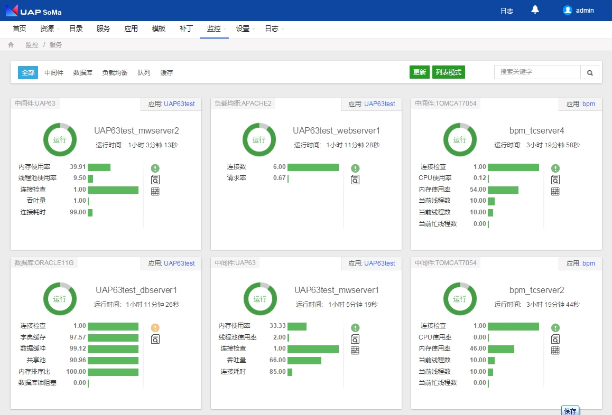
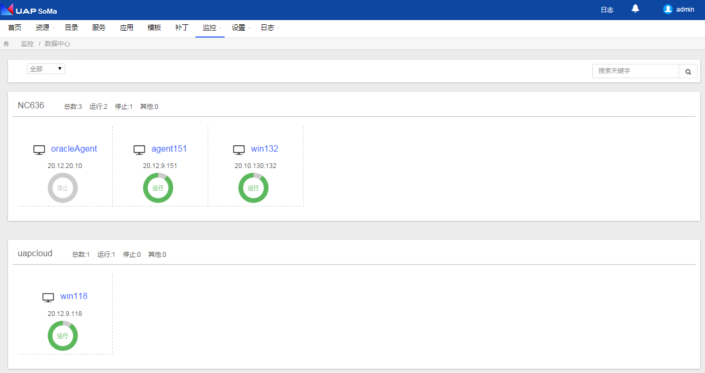

# 资源监控

SoMa平台集中监控平台的所有资源，便于使用者统一、直观、集中的对平台运行状态了如指掌。

### 应用监控 {#-0}

对平台创建的应用进行监控，提供应用的健康报告，日志分析，应用内服务监控报告，线程分析等一系列的可靠可用性报告。

#### 产品展示 {#-9}

1.  应用监控页面：按路径打开【监控】→【应用监控】，显示如下：

图2.2.1.1-1应用监控页面

图2.2.1.1-2应用监控页面

*   图例说明（如图所示，按数字顺序介绍）：
    *   1，查看应用健康报告
    *   2，查看应用的服务性能信息，功能同1
    *   3，运行时间
    *   4，查看应用的警告
    *   5，查看应用的线程
    *   6，应用的类型
    *   7，查看对应参数的实时监控

1.  应用健康报告页面：点击图2.2.1.1-2 〖标号1〗，显示如下：

图2.2.1.1-3应用健康报告页面

1.  应用警报页面：点击图4.2.1.1-2 〖标号4〗，显示如下

图2.2.1.1-4 应用警报页面

1.  应用线程监控页面：点击图4.2.1.1-2 〖标号5〗，显示如下

图2.2.1.1-5应用线程监控页面-列表模式

图2.2.1.1-6应用线程监控页面—图表模式

1.  应用实时监控页面：点击图4.2.1.1-2 〖标号7〗中的“内存使用率”（列表中其他属性的操作情况类似），显示如下

图2.2.1.1-7应用实时监控页面

1.  针对于应用的所有监控属性的实时监控页面：点击图4.2.1.1-2 〖标号1〗-〖实时〗，显示如下：

图2.2.1.1-8应用实时监控页面

#### 监控指标 {#-10}

对于不同类型的应用的监控涉及到不同的监控指标类型，详见如下：

*   APP_JEE：

| **名称** | **说明** | **类型** | **单位** | **表达式** |
| --- | --- | --- | --- | --- |
| memRatio | 内存使用率 | 6 | % | sum(MW.usedHeap)*100/sum(MW.commitHeap) |
| activeSession | 活动回话数 | 6 |  | sum(MW.activeSessions) |

表2.2.1.2-1 APP_JEE应用监控指标

*   APP_NC63：

| **名称** | **说明** | **类型** | **单位** | **表达式** |
| --- | --- | --- | --- | --- |
| memRatio | 内存使用率 | 6 | % | sum(MW.usedHeap)*100/sum(MW.maxHeap) |
| onlineUser | 在线用户数 | 2 |  | count |
| reqRate | 请求率 | 6 |  | sum(WS.reqRate) |

表2.2.1.2-2 APP_NC63应用监控指标

*   APP_UAP636：

| **名称** | **说明** | **类型** | **单位** | **表达式** |
| --- | --- | --- | --- | --- |
| memRatio | 内存使用率 | 6 | % | sum(MW.usedHeap)*100/sum(MW.maxHeap) |
| onlineUser | 在线用户数 | 2 |  | count |
| reqRate | 请求率 | 6 |  | sum(WS.reqRate) |

表2.2.1.2-3 APP_UAP636应用监控指标

以上各表中类型对应的数字实际对应的类型如下表所示：

| **类型编号** | **实际类型** |
| --- | --- |
| 1 | **_BOOLEAN_** |
| 2 | **_GAUGE_** |
| 3 | **_COUNTER_** |
| 4 | **_DERIVE_** |
| 5 | **_ABSOLUTE_** |
| 6 | **_COMPUTE_** |
| 7 | **_LIST_** |

表2.2.1.2-4 类型编号与实际类型的对应关系

该表同样适用于服务和主机的监控指标的类型对应。

#### 应用指南 {#-11}

日志分析

1.  点击图2.2.1.1-9，〖标号1〗，可以分析当前应用的监控日志，如下图：。

图2.2.1.3.1-1应用分析结果页面

1.  在上图对应的页面，可以定义分析的时间间隔，也可以针对不同的监控指标进行展开分析，具体操作为:点击图4.2.1.3.2-1的查询时间和查询属性,如下图：

图2.2.1.3.1-2应用报告列表页面

配置管理监控设置

1.  点击图2.2.1.1-3，〖监控设置〗-〖基本设置〗-〖编辑〗，修改相应的设置项，如下图：。

图2.2.1.3.2-1监控设置基本设置页面

1.  点击图2.2.1.1-3，〖监控设置〗-〖命令参数〗--〖编辑〗，，如下图：

图2.2.1.3.2-2配置监控项页面

1.  点击图2.2.1.1-3，〖监控设置〗-〖监控指标〗-〖编辑〗，，如下图：

图2.2.1.3.2-3配置监控项页面

1.  点击图2.2.1.1-3，〖监控设置〗-〖警报规则〗-〖编辑〗，如下图：

图2.2.1.3.2-4配置监控项页面

配置管理模板配置

1.  点击图2.2.1.1-3，〖模板配置〗，如下图：

图2.2.1.3.3-1模板配置报告模板页面

1.  点击图2.2.1.1-3，〖模板配置〗-〖性能模板〗，如下图：

图2.2.1.3.3-2模板配置性能模板页面

1.  点击图2.2.1.1-3，〖模板配置〗-〖编辑〗，如下图：

图2.2.1.3.3-3模板配置报告模板编辑页面

1.  点击图2.2.1.3.3-1，〖模板配置〗-〖新建分组〗，如下图：

图2.2.1.3.3-4模板配置报告模板新建分组页面

1.  点击图4.2.1.1-3，〖模板配置〗-〖新建模板〗，如下图：。

图2.2.1.3.3-5模板配置报告模板新建模板页面

1.  点击图2.2.1.1-3，〖模板配置〗对应的其他操作（共享、取消共享和设置默认），如下图：

图2.2.1.3.3-6模板配置报告模板其他操作页面

1.  图2.2.1.1-3，〖模板配置〗对应的“性能模板”在编辑、新建分组和新建模板的功能上与“报告模板”类似，操作同上。

### 服务监控 {#-1}

对平台创建的服务进行监控，提供服务的健康报告，日志分析，服务性能，线程分析等一系列的可靠可用性报告。

#### 产品展示 {#-12}

1.  服务监控页面：按路径打开【监控】→【服务监控】，可以按照服务类型筛选进行查看，如下：

图2.2.2.1-1服务监控页面

图2.2.2.1-2服务监控页面—中间件

图2.2.2.1-3服务监控页面—数据库

图2.2.2.1-4服务监控页面—负载均衡

图2.2.2.1-5服务监控页面—队列

图2.2.2.1-6服务监控页面—缓存

针对于具体某个服务中间件的监控情况如图4.2.2.1-7所示：

图2.2.2.1-7服务监控卡片—中间件

*   图例说明（如图4.2.2.1-7所示，按数字顺序介绍）：
    *   1，查看服务健康报告
    *   2，查看服务的性能信息，功能同1
    *   3，查看服务的运行时间
    *   4，查看服务的警报
    *   5，查看服务的日志
    *   6，查看服务的线程信息
    *   7，服务绑定的应用
    *   8，服务对应的类型
    *   9，查看对应参数的实时监控

针对于具体某个服务数据库的监控情况如图4.2.2.1-8所示：

图2.2.2.1-8服务监控页面—数据库

*   图例4.2.2.1-8说明（如图所示，按数字顺序介绍）：
    *   1，查看服务健康报告
    *   2，查看服务的性能信息，功能同1
    *   3，查看服务的运行时间
    *   4，查看服务的警报
    *   5，查看服务的日志
    *   6，服务绑定的应用
    *   7，服务对应的类型
    *   8，查看对应参数的实时监控

针对于具体某个服务负载均衡的监控情况如图2.2.2.1-9所示：

图2.2.2.1-9服务监控页面—负载均衡

*   图例4.2.2.1-9说明（如图所示，按数字顺序介绍）：
    *   1，查看服务健康报告
    *   2，查看服务的性能信息，功能同1
    *   3，查看服务的运行时间
    *   4，查看服务的警报
    *   5，查看服务的日志
    *   6，服务绑定的应用
    *   7，服务对应的类型
    *   8，查看对应参数的实时监控

针对于具体某个服务队列的监控情况如图2.2.2.1-10所示：

图2.2.2.1-10服务监控页面—队列

*   图例4.2.2.1-10说明（如图所示，按数字顺序介绍）：
    *   1，查看服务健康报告。
    *   2，查看服务的性能信息，功能同1
    *   3，查看服务的运行时间
    *   4，查看服务的警报。
    *   5，查看服务的日志
    *   6，查看服务的队列信息
    *   7，查看服务的线程信息
    *   8，查看服务的Topic信息
    *   9，服务绑定的应用
    *   10，服务对应的类型
    *   11，查看对应参数的实时监控

针对于具体某个服务缓存的监控情况如图2.2.2.1-11所示：

图2.2.2.1-11服务监控页面—缓存

*   图例4.2.2.1-11说明（如图所示，按数字顺序介绍）：
    *   1，查看服务健康报告
    *   2，查看服务的性能信息，功能同1
    *   3，查看服务的运行时间
    *   4，查看服务的警报
    *   5，查看服务的日志
    *   6，服务绑定的应用
    *   7，服务对应的类型
    *   8，查看对应参数的实时监控

1.  中间件服务健康报告页面：点击图2.2.2.1-7〖标号1〗，显示如下：

图2.2.2.1-12服务健康报告页面—中间件

1.  中间件服务警报监控页面：点击图2.2.2.1-7〖标号4〗，显示如下：

图2.2.2.1-13服务警报页面—中间件

1.  中间件服务日志监控页面：点击图2.2.2.1-7〖标号5〗，显示如下：

图2.2.2.1-14服务日志页面—中间件

日志可以提供下载的功能，但是必须先“查看”，才能下载。

1.  中间件服务线程监控页面：点击图2.2.2.1-7〖标号6〗，显示如下：

图2.2.2.1-15服务线程监控页面—中间件

1.  中间件服务实时监控页面：点击图2.2.2.1-7〖标号9〗中的“内存使用率”（列表中其他属性的操作情况类似），显示如下：

图2.2.2.1-16服务实时监控页面—中间件

1.  针对于服务中某个具体的间件的实时监控信息：点击图2.2.2.1-15中的实时按钮显示如下：

图2.2.2.1-17服务实时监控所有属性页面—中间件

1.  数据库服务健康报告页面：点击图2.2.2.1-8〖标号1〗，显示如下：

图2.2.2.1-18服务健康报告页面—数据库

1.  数据库服务警报监控页面：点击图2.2.2.1-8〖标号4〗，显示如下：

图2.2.2.1-19服务警报监控页面—数据库

1.  数据库服务日志页面：点击图2.2.2.1-8〖标号5〗，显示如下：

图2.2.2.1-20服务日志页面—数据库

日志可以提供下载的功能，但是必须先“查看”，才能下载。

1.  数据库服务实时监控页面：点击图2.2.2.1-8〖标号8〗中的“连接检查”（列表中其他属性的操作情况类似），显示如下：

图2.2.2.1-21服务实时监控页面—数据库

1.  针对于服务中某个具体的数据库的实时监控信息：点击图2.2.2.1-18中的实时按钮显示如下：

图2.2.2.1-22服务实时监控全部属性页面—数据库

1.  负载均衡服务健康报告页面：点击图2.2.2.1-9〖标号1〗，显示如下：

图2.2.2.1-23服务健康报告页面—负载均衡

1.  负载均衡服务警报监控页面：点击图2.2.2.1-9〖标号4〗，显示如下：

图2.2.2.1-24服务警报监控页面—负载均衡

1.  负载均衡服务日志页面：点击图2.2.2.1-9〖标号5〗，显示如下：

图2.2.2.1-25服务日志页面—负载均衡

日志可以提供下载的功能，但是必须先“查看”，才能下载。

1.  负载均衡服务实时监控页面：点击图2.2.2.1-9〖标号8〗中的“连接数”（列表中其他属性的操作情况类似），显示如下：

图2.2.2.1-26服务实时监控页面—负载均衡

1.  针对于服务中某个具体的负载均衡的实时监控信息：点击图2.2.2.1-23中的实时按钮显示如下：

图2.2.2.1-27服务实时监控全部属性页面—负载均衡

1.  队列服务健康报告页面：点击图2.2.2.1-10〖标号1〗，显示如下：

图2.2.2.1-28服务健康报告页面—队列

1.  队列服务警报监控页面：点击图2.2.2.1-10〖标号4〗，显示如下：

图2.2.2.1-29服务警报监控页面—队列

1.  队列服务日志页面：点击图2.2.2.1-10〖标号5〗，显示如下：

图2.2.2.1-30服务日志页面—队列

日志可以提供下载的功能，但是必须先“查看”，才能下载。

1.  队列服务查看队列页面：点击图2.2.2.1-10〖标号6〗，显示如下：

图2.2.2.1-31服务查看队列页面—队列

1.  队列服务查看线程页面：点击图2.2.2.1-10〖标号7〗，显示如下：

图2.2.2.1-32服务查看线程页面—队列

1.  队列服务Topic监控页面：点击图2.2.2.1-10〖标号8〗，显示如下：

图2.2.2.1-33服务Topic监控页面—队列

1.  队列服务实时监控页面：点击图2.2.2.1-10〖标号9〗中的“CPU使用率”（列表中其他属性的操作情况类似），显示如下：

图2.2.2.1-34服务实时监控页面—队列

1.  针对于服务中某个具体的数据库的实时监控信息：点击图2.2.2.1-31中的实时按钮显示如下：

图2.2.2.1-35服务实时监控全部属性页面—队列

1.  缓存服务健康报告页面：点击图2.2.2.1-11〖标号1〗，显示如下：

图2.2.2.1-36服务健康报告页面—缓存

1.  缓存服务警报监控页面：点击图2.2.2.1-11〖标号4〗，显示如下：

图2.2.2.1-37服务警报监控页面—缓存

1.  缓存服务日志页面：点击图2.2.2.1-11〖标号5〗，显示如下：

图2.2.2.1-38服务日志页面—缓存

日志可以提供下载的功能，但是必须先“查看”，才能下载。

1.  缓存服务实时监控页面：点击图2.2.2.1-11〖标号8〗中的“连接检查”（列表中其他属性的操作情况类似），显示如下：

图2.2.2.1-39服务实时监控页面—缓存

1.  针对于服务中某个具体的缓存的实时监控信息：点击图2.2.2.1-36中的实时按钮显示如下：

图2.2.2.1-40服务实时监控全部属性页面—缓存

对于服务的监控分为5种类型，分别为数据库、中间件、负载均衡、队列、缓存，监控指标如下：

*   数据库监控指标：

| **名称** | **说明** | **类型** | **单位** | **表达式** |
| --- | --- | --- | --- | --- |
| connected | 内存使用率 | 2 |  | connected |
| insert | 插入 | 2 | /s | insert |
| query | 查询 | 2 | /s | query |
| update | 更新 | 2 | /s | update |
| delete | 删除 | 2 | /s | delete |
| getmore | 获取更多 | 2 | /s | getmore |
| command | 命令数 | 2 |  | command |
| flush | 刷新次数 | 2 | /s | flush |
| mapped | 内存映射 | 2 | MB | mapped |
| vsize | 虚拟内存 | 2 | MB | vsize |
| res | 物理内存 | 2 | MB | res |
| faults | 故障 | 2 | /s | faults |
| locked | 写锁 | 2 | % | locked |
| idxMiss | 未命中 | 2 | % | idxMiss |
| qr | 读队列 | 2 |  | qr |
| qw | 写队列 | 2 |  | qw |
| ar | 读客户端 | 2 |  | ar |
| aw | 写客户端 | 2 |  | aw |
| netIn | 流入 | 2 | bit | netIn |
| netOut | 流出 | 2 | bit | netOut |
| conn | 连接数 | 2 |  | conn |

表2.2.2.2-1 MongoDB服务监控指标

| **名称** | **说明** | **类型** | **单位** | **表达式** |
| --- | --- | --- | --- | --- |
| connected | 内存使用率 | 2 |  | connected |
| dict_hit | 字典缓存 | 2 | % | dict_hit |
| cache_hit | 数据缓冲 | 2 | % | cache_hit |
| lib_hit | 共享池 | 2 | % | lib_hit |
| sorts_memory_rate | 内存排序比 | 2 | % | sorts_memory_rate |
| activeSession | 活动会话数 | 2 |  | activeSession |
| physical_reads | 物理读 | 2 |  | physical_reads |
| physical_write | 物理写 | 2 |  | physical_write |
| db_block_gets | 当前读 | 2 |  | db_block_gets |
| consistent_gets | 一致读 | 2 |  | consistent_gets |
| sorts_disk | 磁盘排序 | 2 |  | sorts_disk |
| sorts_memory | 内存排序 | 2 |  | sorts_memory |
| user_calls | 用户调用数 | 2 |  | user_calls |
| user_commits | 用户提交数 | 2 |  | user_commits |
| user_rollbacks | 用户回滚数 | 2 |  | user_rollbacks |
| redo_size | 重做记录数 | 2 |  | redo_size |
| dbLocked | dbLocked | 2 |  | dbLocked |
| dbLockInfos | dbLockInfos | 0 |  | dbLockInfos |

表2.2.2.2-2 Oracle11g服务监控指标

| **名称** | **说明** | **类型** | **单位** | **表达式** |
| --- | --- | --- | --- | --- |
| connected | 内存使用率 | 2 |  | connected |
| numbackends |  | 2 |  | numbackends |
| size |  | 2 | KB | size |
| xact_commit |  | 2 |  | xact_commit |
| xact_rollback |  | 2 |  | xact_rollback |
| blks_read |  | 2 |  | blks_read |
| blks_hit |  | 2 |  | blks_hit |
| blk_read_time |  | 2 | ms | blk_read_time |
| blk_write_time |  | 2 | ms | blk_write_time |

表2.2.2.2-3 PostGreSQL服务监控指标

*   中间件监控指标：

| **名称** | **说明** | **类型** | **单位** | **表达式** |
| --- | --- | --- | --- | --- |
| connected | 连接 | 2 |  | connected |
| cpuRatio | CPU使用率 | 2 | % | cpuRatio |
| heapRatio | 内存使用率 | 2 | % | heapRatio |
| nonHeapRatio | nonHeapRatio | 2 | % | nonHeapRatio |
| permHeapRatio | permHeapRatio | 2 | % | permHeapRatio |
| youngHeapRatio | youngHeapRatio | 2 | % | youngHeapRatio |
| oldHeapRatio | oldHeapRatio | 2 | % | oldHeapRatio |
| commitHeap | 分配内存 | 2 | MB | commitHeap |
| usedHeap | 已用内存 | 2 | MB | usedHeap |
| commitNonHeap | commitNonHeap | 2 | MB | commitNonHeap |
| usedNonHeap | usedNonHeap | 2 | MB | usedNonHeap |
| commitPermHeap | commitPermHeap | 2 | MB | commitPermHeap |
| usedPermHeap | usedPermHeap | 2 | MB | usedPermHeap |
| commitYoungHeap | commitYoungHeap | 2 | MB | commitYoungHeap |
| usedYoungHeap | usedYoungHeap | 2 | MB | usedYoungHeap |
| commitOldHeap | commitOldHeap | 2 | MB | commitOldHeap |
| usedOldHeap | usedOldHeap | 2 | MB | usedOldHeap |
| usedOldHeap | usedOldHeap | 2 | MB | usedOldHeap |
| youngGc | youngGc | 2 |  | youngGc |
| fullGc | fullGc | 2 |  | fullGc |
| youngGcCost | youngGcCost | 2 |  | youngGcCost |
| avgYoungGcCost | avgYoungGcCost | 2 |  | avgYoungGcCost |
| fullGcCost | fullGcCost | 2 |  | fullGcCost |
| avgFullGcCost | avgFullGcCost | 2 |  | avgFullGcCost |
| loadedClass | loadedClass | 2 |  | loadedClass |
| maxThreads | 最大线程数 | 2 |  | maxThreads |
| currentThreadCount | 当前线程数 | 2 |  | currentThreadCount |
| currentThreadsBusy | 当前忙线程数 | 2 |  | currentThreadsBusy |
| activeSessions | 活动会话数 | 2 |  | activeSessions |
| sessionCounter | 总会话数 | 2 |  | sessionCounter |

表2.2.2.2-4 Tomcat7服务监控指标

| **名称** | **说明** | **类型** | **单位** | **表达式** |
| --- | --- | --- | --- | --- |
| ratio | 内存使用率 | 2 | % | ratio |
| threadPoolUsed | 线程池使用率 | 2 | % | threadPoolUsed |
| connected | 连接 | 2 |  | connected |
| throughput | 吞吐量 | 2 |  | throughput |
| lastcheckcost | 连接耗时 | 2 | ms | lastcheckcost |
| maxHeap | 最大内存 | 2 |  | maxHeap |
| usedHeap | 已用内存 | 2 |  | usedHeap |
| bgThreadNum | 后台线程数 | 2 |  | bgThreadNum |
| webThreadNum | web线程数 | 2 |  | webThreadNum |

表2.2.2.2-5 UAP63服务监控指标

| **名称** | **说明** | **类型** | **单位** | **表达式** |
| --- | --- | --- | --- | --- |
| ratio | 内存使用率 | 2 | % | ratio |
| threadPoolUsed | 线程池使用率 | 2 | % | threadPoolUsed |
| connected | 连接 | 2 |  | connected |
| throughput | 吞吐量 | 2 |  | throughput |
| lastcheckcost | 连接耗时 | 2 | ms | lastcheckcost |
| maxHeap | 最大内存 | 2 |  | maxHeap |
| usedHeap | 已用内存 | 2 |  | usedHeap |
| bgThreadNum | 后台线程数 | 2 |  | bgThreadNum |
| webThreadNum | web线程数 | 2 |  | webThreadNum |

表2.2.2.2-6 UAP636服务监控指标

| **名称** | **说明** | **类型** | **单位** | **表达式** |
| --- | --- | --- | --- | --- |
| heapRatio | 内存使用率 | 2 | % | heapRatio |
| cpuRatio | CPU使用率 | 2 | % | cpuRatio |
| maxHeap | 最大内存 | 2 | MB | maxHeap |
| usedHeap | 已用内存 | 2 | MB | usedHeap |
| webPoolSize | Web线程池 | 2 |  | webPoolSize |
| webActiveCount | 活动Web线程 | 2 |  | webActiveCount |
| orbPoolSize | ORB线程池 | 2 |  | orbPoolSize |
| orbActiveCount | 活动ORB线程 | 2 |  | orbActiveCount |
| createCount | 创建数 | 2 |  | createCount |
| closeCount | 关闭数 | 2 |  | closeCount |
| connPoolSize | 连接池 | 2 |  | connPoolSize |
| freePoolSize | 空闲池 | 2 |  | freePoolSize |
| waitingThreadCount | 等待线程 | 2 |  | waitingThreadCount |
| percentUsed | 连接池使用率 | 2 | % | percentUsed |
| useTime | 使用时间 | 2 | ms | useTime |
| waitTime | 等待时间 | 2 | ms | waitTime |
| sessionCount | 会话数 | 2 |  | sessionCount |
| cpuUsageSinceLast | 平均CPU使用率 | 2 | % | cpuUsageSinceLast |
| activeTransactions | 活动事务 | 2 |  | activeTransactions |
| committedCount | 提交 | 2 |  | committedCount |
| rolledbackCount | 回滚 | 2 |  | rolledbackCount |
| totalRequests | 总请求数 | 2 |  | totalRequests |
| responseTime | 响应时间 | 2 |  | responseTime |

表2.2.2.2-7 WAS7服务监控指标

| **名称** | **说明** | **类型** | **单位** | **表达式** |
| --- | --- | --- | --- | --- |
| heapRatio | 内存使用率 | 2 | % | heapRatio |
| cpuRatio | CPU使用率 | 2 | % | cpuRatio |
| maxHeap | 最大内存 | 2 | MB | maxHeap |
| usedHeap | 已用内存 | 2 | MB | usedHeap |
| webPoolSize | Web线程池 | 2 |  | webPoolSize |
| webActiveCount | 活动Web线程 | 2 |  | webActiveCount |
| orbPoolSize | ORB线程池 | 2 |  | orbPoolSize |
| orbActiveCount | 活动ORB线程 | 2 |  | orbActiveCount |
| createCount | 创建数 | 2 |  | createCount |
| closeCount | 关闭数 | 2 |  | closeCount |
| connPoolSize | 连接池 | 2 |  | connPoolSize |
| freePoolSize | 空闲池 | 2 |  | freePoolSize |
| waitingThreadCount | 等待线程 | 2 |  | waitingThreadCount |
| percentUsed | 连接池使用率 | 2 | % | percentUsed |
| useTime | 使用时间 | 2 | ms | useTime |
| waitTime | 等待时间 | 2 | ms | waitTime |
| sessionCount | 会话数 | 2 |  | sessionCount |
| cpuUsageSinceLast | 平均CPU使用率 | 2 | % | cpuUsageSinceLast |
| activeTransactions | 活动事务 | 2 |  | activeTransactions |
| committedCount | 提交 | 2 |  | committedCount |
| rolledbackCount | 回滚 | 2 |  | rolledbackCount |
| totalRequests | 总请求数 | 2 |  | totalRequests |
| responseTime | 响应时间 | 2 |  | responseTime |

表2.2.2.2-8 WAS85服务监控指标

| **名称** | **说明** | **类型** | **单位** | **表达式** |
| --- | --- | --- | --- | --- |
| heapRatio | 内存使用率 | 2 | % | heapUsedPercent |
| maxHeap | 最大内存 | 2 | B | heapSizeMax |
| usedHeap | 已用内存 | 2 | B | heapSizeCurrent |
| throughput | 吞吐量 | 2 |  | throughput |
| completedRequestCount | 完成请求数 | 2 |  | completedRequestCount |
| pendingUserRequestCount | 待定用户请求数 | 2 |  | pendingUserRequestCount |
| queueLength | 队列长度 | 2 |  | queueLength |
| activeConnectionsCurrentCount | 活动连接数 | 2 |  | activeConnectionsCurrentCount |
| activeConnectionsHighCount | 最大活动连接数 | 2 |  | activeConnectionsHighCount |
| connectionsTotalCount | 总连接数 | 2 |  | connectionsTotalCount |
| highestNumAvailable | 可用连接数 | 2 |  | highestNumAvailable |
| highestNumUnavailable | 不可用连接数 | 2 |  | highestNumUnavailable |
| waitingForConnectionCurrentCount | 等待连接数 | 2 |  | waitingForConnectionCurrentCount |
| waitingForConnectionHighCount | 最大等待连接数 | 2 |  | waitingForConnectionHighCount |
| openSocketsCurrentCount | 当前Socket数 | 2 | % | openSocketsCurrentCount |
| socketsOpenedTotalCount | Socket总数 | 2 | ms | socketsOpenedTotalCount |
| executeThreadCount | 活动线程数 | 2 | ms | executeThreadCount |
| executeThreadIdleCount | 空闲线程数 | 2 |  | executeThreadIdleCount |
| standbyThreadCount | 待机线程数 | 2 | % | standbyThreadCount |
| hoggingThreadCount | 独占线程数 | 2 |  | hoggingThreadCount |
| executeThreadTotalCount | 执行线程总数 | 2 |  | executeThreadTotalCount |
| connected | 连接 | 2 |  | connected |

表2.2.2.2-9 WAS10服务监控指标

| **名称** | **说明** | **类型** | **单位** | **表达式** |
| --- | --- | --- | --- | --- |
| heapRatio | 内存使用率 | 2 | % | heapUsedPercent |
| maxHeap | 最大内存 | 2 | B | heapSizeMax |
| usedHeap | 已用内存 | 2 | B | heapSizeCurrent |
| throughput | 吞吐量 | 2 |  | throughput |
| completedRequestCount | 完成请求数 | 2 |  | completedRequestCount |
| pendingUserRequestCount | 待定用户请求数 | 2 |  | pendingUserRequestCount |
| queueLength | 队列长度 | 2 |  | queueLength |
| activeConnectionsCurrentCount | 活动连接数 | 2 |  | activeConnectionsCurrentCount |
| activeConnectionsHighCount | 最大活动连接数 | 2 |  | activeConnectionsHighCount |
| connectionsTotalCount | 总连接数 | 2 |  | connectionsTotalCount |
| highestNumAvailable | 可用连接数 | 2 |  | highestNumAvailable |
| highestNumUnavailable | 不可用连接数 | 2 |  | highestNumUnavailable |
| waitingForConnectionCurrentCount | 等待连接数 | 2 |  | waitingForConnectionCurrentCount |
| waitingForConnectionHighCount | 最大等待连接数 | 2 |  | waitingForConnectionHighCount |
| openSocketsCurrentCount | 当前Socket数 | 2 | % | openSocketsCurrentCount |
| socketsOpenedTotalCount | Socket总数 | 2 | ms | socketsOpenedTotalCount |
| executeThreadCount | 活动线程数 | 2 | ms | executeThreadCount |
| executeThreadIdleCount | 空闲线程数 | 2 |  | executeThreadIdleCount |
| standbyThreadCount | 待机线程数 | 2 | % | standbyThreadCount |
| hoggingThreadCount | 独占线程数 | 2 |  | hoggingThreadCount |
| executeThreadTotalCount | 执行线程总数 | 2 |  | executeThreadTotalCount |
| connected | 连接 | 2 |  | connected |

表2.2.2.2-10 WAS11服务监控指标

*   负载均衡监控指标：

| **名称** | **说明** | **类型** | **单位** | **表达式** |
| --- | --- | --- | --- | --- |
| procNum | 连接数 | 2 |  | procNum |
| reqRate | 请求率 | 2 | r/s | reqRate |
| byteReq | 每请求字节数 | 2 | B/r | byteReq |
| byteSec | 每秒字节数 | 2 | B/s | byteSec |
| kByteTotal | 总流量 | 2 | KB | kByteTotal |
| upTime | 持续时间 | 2 | s | upTime |

表2.2.2.2-11 Apache2服务监控指标

| **名称** | **说明** | **类型** | **单位** | **表达式** |
| --- | --- | --- | --- | --- |
| procNum | 连接数 | 2 |  | procNum |
| reqRate | 请求率 | 2 |  | reqRate |
| byteReq | 每请求字节数 | 2 |  | byteReq |
| byteSec | 每秒字节数 | 2 |  | byteSec |
| kByteTotal | 总流量 | 2 |  | kByteTotal |
| upTime | 持续时间 | 2 |  | upTime |

表2.2.2.2-12 HAPROXY服务监控指标

| **名称** | **说明** | **类型** | **单位** | **表达式** |
| --- | --- | --- | --- | --- |
| procNum | 连接数 | 2 |  | procNum |
| reqRate | 请求率 | 2 |  | reqRate |
| byteReq | 每请求字节数 | 2 |  | byteReq |
| byteSec | 每秒字节数 | 2 |  | byteSec |
| kByteTotal | 总流量 | 2 |  | kByteTotal |
| upTime | 持续时间 | 2 |  | upTime |

表2.2.2.2-13 IHS6服务监控指标

| **名称** | **说明** | **类型** | **单位** | **表达式** |
| --- | --- | --- | --- | --- |
| procNum | 连接数 | 2 |  | procNum |
| reqRate | 请求率 | 2 |  | reqRate |
| byteReq | 每请求字节数 | 2 |  | byteReq |
| byteSec | 每秒字节数 | 2 |  | byteSec |
| kByteTotal | 总流量 | 2 |  | kByteTotal |
| upTime | 持续时间 | 2 |  | upTime |

表2.2.2.2-14 IHS7服务监控指标

| **名称** | **说明** | **类型** | **单位** | **表达式** |
| --- | --- | --- | --- | --- |
| procNum | 连接数 | 2 |  | procNum |
| reqRate | 请求率 | 2 |  | reqRate |
| byteReq | 每请求字节数 | 2 |  | byteReq |
| byteSec | 每秒字节数 | 2 |  | byteSec |
| kByteTotal | 总流量 | 2 |  | kByteTotal |
| upTime | 持续时间 | 2 |  | upTime |

表2.2.2.2-15 IHS85服务监控指标

*   队列监控指标：

| **名称** | **说明** | **类型** | **单位** | **表达式** |
| --- | --- | --- | --- | --- |
| cpuRatio | CPU使用率 | 2 | % | cpuRatio |
| heapRatio | heapRatio | 2 | % | heapRatio |
| nonHeapRatio | nonHeapRatio | 2 | % | nonHeapRatio |
| permHeapRatio | permHeapRatio | 2 | % | permHeapRatio |
| youngHeapRatio | youngHeapRatio | 2 | % | youngHeapRatio |
| oldHeapRatio | oldHeapRatio | 2 | % | oldHeapRatio |
| commitHeap | 分配内存 | 2 | MB | commitHeap |
| usedHeap | 已用内存 | 2 | MB | usedHeap |
| commitNonHeap | commitNonHeap | 2 | MB | commitNonHeap |
| usedNonHeap | usedNonHeap | 2 | MB | usedNonHeap |
| commitPermHeap | commitPermHeap | 2 | MB | commitPermHeap |
| usedPermHeap | usedPermHeap | 2 | MB | usedPermHeap |
| commitYoungHeap | commitYoungHeap | 2 | MB | commitYoungHeap |
| usedYoungHeap | usedYoungHeap | 2 | MB | usedYoungHeap |
| commitOldHeap | commitOldHeap | 2 | MB | commitOldHeap |
| usedOldHeap | usedOldHeap | 2 | MB | usedOldHeap |
| usedOldHeap | usedOldHeap | 2 | MB | usedOldHeap |
| youngGc | youngGc | 2 |  | youngGc |
| fullGc | fullGc | 2 |  | fullGc |
| youngGcCost | youngGcCost | 2 |  | youngGcCost |
| avgYoungGcCost | avgYoungGcCost | 2 |  | avgYoungGcCost |
| fullGcCost | fullGcCost | 2 |  | fullGcCost |
| avgFullGcCost | avgFullGcCost | 2 |  | avgFullGcCost |
| loadedClass | loadedClass | 2 |  | loadedClass |
| peakThreadCount | 最大线程数 | 2 |  | peakThreadCount |
| deamonThreadCount | 守护线程数 | 2 |  | deamonThreadCount |
| currentThreadCount | 当前线程数 | 2 |  | currentThreadCount |
| currentConnectionsCount | 连接数 | 2 |  | currentConnectionsCount |
| averageMessageSize | 平均消息大小 | 2 | B | averageMessageSize |
| maxMessageSize | 最大消息大小 | 2 | B | maxMessageSize |
| totalMessageCount | 消息总数 | 2 |  | totalMessageCount |
| totalConsumerCount | 消费者总数 | 2 |  | totalConsumerCount |
| enqueueCount | 每秒入列数 | 2 |  | enqueueCount |
| dequeueCount | 每秒出列数 | 2 |  | dequeueCount |
| totalEnqueueCount | 入列总数 | 2 |  | totalEnqueueCount |
| totalDequeueCount | 出列总数 | 2 |  | totalDequeueCount |
| memoryPercentUsage | 已使用内存比 | 2 |  | memoryPercentUsage |
| tempPercentUsage | 已使用临时文件比 | 2 |  | tempPercentUsage |

表2.2.2.2-16 ACTIVEMQ服务监控指标

*   缓存监控指标：

| **名称** | **说明** | **类型** | **单位** | **表达式** |
| --- | --- | --- | --- | --- |
| connected | 内存使用率 | 2 |  | connected |
| pid |  | 0 |  | pid |
| uptime | 更新时间 | 2 | s | uptime |
| version | 版本 | 0 |  | version |
| rusage_user | 进程用户时长 | 2 | s | rusage_user |
| rusage_system | 进程系统时长 | 2 | s | rusage_system |
| total_connections | 总连接数 | 2 |  | total_connections |
| curr_connections | 当前连接数 | 2 |  | curr_connections |
| connection_structures | 连接构造数 | 2 |  | connection_structures |
| cmd_get | 获取 | 2 |  | cmd_get |
| cmd_set | 保存 | 2 |  | cmd_set |
| get_hits | 请求命中 | 2 |  | get_hits |
| get_misses | 请求失败 | 2 |  | get_misses |
| evictions | 淘汰数 | 2 |  | evictions |
| bytes | 键值内存 | 2 | B | bytes |
| curr_items | 当前键值数 | 2 |  | curr_items |
| total_items | 总键值数 | 2 |  | total_items |
| bytes_read | 请求字节数 | 2 | B | bytes_read |
| bytes_written | 结果字节数 | 2 | B | bytes_written |
| threads | 线程数 | 2 |  | threads |
| limit_maxbytes | 内存总量 | 2 | MB | limit_maxbytes |

表2.2.2.2-17 Memcache服务监控指标

| **名称** | **说明** | **类型** | **单位** | **表达式** |
| --- | --- | --- | --- | --- |
| connected | 连接 | 2 |  | connected |
| connected_clients | 客户端连接数 | 2 |  | connected_clients |
| blocked_clients | 客户端阻塞数 | 2 |  | blocked_clients |
| used_memory | 已用内存 | 2 | B | used_memory |
| used_memory_rss | 常驻内存 | 2 |  | used_memory_rss |
| used_memory_peak | 内存峰值 | 2 | B | used_memory_peak |
| used_memory_lua | Lua引擎内存 | 2 | B | used_memory_lua |
| mem_fragmentation_ratio | 碎片比 | 2 | % | mem_fragmentation_ratio |
| rdb_bgsave_in_progress | 正在保存 | 2 |  | rdb_bgsave_in_progress |
| rdb_changes_since_last_save | 改动次数 | 2 |  | rdb_changes_since_last_save |
| rdb_last_bgsave_time_sec | 上次保存耗时 | 2 | s | rdb_last_bgsave_time_sec |
| rdb_current_bgsave_time_sec | 当前保存耗时 | 2 |  | rdb_current_bgsave_time_sec |
| aof_rewrite_in_progress | 正在重写 | 2 |  | aof_rewrite_in_progress |
| aof_last_rewrite_time_sec | 上次重写耗时 | 2 | s | aof_last_rewrite_time_sec |
| aof_current_rewrite_time_sec | 当前重写耗时 | 2 | s | aof_current_rewrite_time_sec |
| aof_current_size | Aof当前大小 | 2 | B | aof_current_size |
| aof_base_size | 上次Aof大小 | 2 | B | aof_base_size |
| aof_buffer_length | Aof缓存 | 2 | B | aof_buffer_length |
| aof_rewrite_buffer_length | Aof重写缓存 | 2 | B | aof_rewrite_buffer_length |
| aof_pending_bio_fsync | Fsync等待 | 2 |  | aof_pending_bio_fsync |
| aof_delayed_fsync | Fsync延迟 | 2 |  | aof_delayed_fsync |
| total_connections_received | 连接总数 | 2 |  | total_connections_received |
| rejected_connections | 拒绝连接数 | 2 |  | rejected_connections |
| total_commands_processed | 命令总数 | 2 |  | total_commands_processed |
| instantaneous_ops_per_sec | 命令个数 | 2 | /s | instantaneous_ops_per_sec |
| expired_keys | 过期键数 | 2 |  | expired_keys |
| evicted_keys | 淘汰键数 | 2 |  | evicted_keys |
| keyspace_hits | 键命中 | 2 |  | keyspace_hits |
| keyspace_misses | 键未命中 | 2 |  | keyspace_misses |
| pubsub_channels | 频道数 | 2 |  | pubsub_channels |
| pubsub_patterns | 模式数 | 2 |  | pubsub_patterns |
| latest_fork_usec | Fork耗时 | 2 | ms | latest_fork_usec |
| connected_slaves | 从服务器 | 2 |  | connected_slaves |
| used_cpu_sys | 系统CPU | 2 | % | used_cpu_sys |
| used_cpu_user | 用户CPU | 2 | % | used_cpu_user |
| used_cpu_sys_children | 后台进程系统CPU | 2 | % | used_cpu_sys_children |
| used_cpu_user_children | 后台进程用户CPU | 2 | % | used_cpu_user_children |

表2.2.2.2-18 Redis服务监控指标

### 主机监控 {#-2}

对平台的主机进行监控，提供主机的健康报告，性能，TOP10等一系列的可靠可用性报告。

#### 产品展示 {#-13}

1.  主机监控页面：按路径打开【监控】→【主机监控】，显示如下：

图2.2.3.1-1主机监控页面

针对于具体某个主机的监控情况如图2.2.3.1-2所示：

图2.2.3.1-2主机监控页面

*   图例说明（如图所示，按数字顺序介绍）：
    *   1，查看主机健康报告
    *   2，查看服务的性能信息，功能同1
    *   3，管理IP
    *   4，查看主机的警报
    *   5，查看主机的日志
    *   6，查看对应参数的实时监控

1.  主机健康评估页面，点击图2.2.3.1-2〖标号1〗，如图：

图2.2.3.1-3主机健康评估页面

1.  主机性能监控，点击图2.2.3.1-2〖标号4〗，如图

图2.2.3.1-4主机性能监控页面

1.  主机查看日志，点击图2.2.3.1-2〖标号5〗，如图

图2.2.3.1-5主机查看日志页面

可以在该页面选择一种日志类型进行查看，点击后效果如下：

图2.2.3.1-6主机查看日志页面

日志可以提供下载的功能，但是必须先“查看”，才能下载。

1.  主机对应参数实时监控，点击图2.2.3.1-2〖标号6〗中的“内存使用率”（列表中其他属性的操作情况类似），如图

图2.2.3.1-7主机性能监控页面

1.  主机监控设置页面：按路径打开【监控】→【主机】→【监控设置】，如图：

图2.2.3.1-8主机监控设置页面

1.  主机监控项页面：点击图2.2.3.1-8〖命令参数〗，如图：

图2.2.3.1-9主机监控项页面

1.  主机监控指标页面：点击图2.2.3.1-8〖监控指标〗，如图：

图2.2.3.1-10主机监控指标页面

1.  主机监控指标页面：点击图2.2.3.1-8〖警报规则〗，如图：

图2.2.3.1-11主机监控指标页面

#### 监控指标 {#-14}

对于主机的监控涉及到如下监控指标：

| **名称** | **说明** | **类型** | **单位** | **表达式** |
| --- | --- | --- | --- | --- |
| memRatio | 内存使用率 | 2 |  | memRatio |
| cpuRatio | CPU使用率 | 2 |  | cpuRatio |
| iowait | 硬盘IO等待 | 2 |  | iowait |
| diskRatio | 磁盘使用率 | 2 |  | diskRatio |
| load_5 | 5分钟负载 | 2 |  | load_5 |
| load_1 | 1分钟负载 | 2 |  | load_1 |
| load_15 | 15分钟负载 | 2 |  | load_15 |
| free | 可用内存 | 2 |  | free |
| total | 内存总量 | 2 |  | total |
| user | User | 2 |  | user |
| nice | Nice | 2 |  | nice |
| system | System | 2 |  | system |
| idle | Idle | 2 |  | idle |
| rx | 下行流量 | 2 |  | rx |
| tx | 上行流量 | 2 |  | tx |
| diskTotal | 磁盘总量 | 2 |  | diskTotal |
| diskUsed | 磁盘使用量 | 2 |  | diskUsed |
| diskFree | 磁盘剩余量 | 2 |  | diskFree |
| readIO | 磁盘读 | 2 |  | readIO |
| writeIO | 磁盘写 | 2 |  | writeIO |
| swap_total | swap总量 | 2 |  | swap_total |
| swap_used | swap使用量 | 2 |  | swap_used |
| swap_free | swap剩余量 |  |  | swap_free |
| pageIn | 页换入 |  |  | pageIn |
| pageOut | 页换出 |  |  | pageOut |
| running | 运行 |  |  | running |
| sleeping | 等待 |  |  | sleeping |
| stopped | 停止 |  |  | stopped |
| idles | 空闲 |  |  | idles |
| zombie | 僵尸进程 |  |  | zombie |
| threads | 线程数 |  |  | threads |

表2.2.2.2-1 主机监控指标

#### 应用指南 {#-15}

配置管理设置

1.  点击图2.2.1.1-6，〖编辑〗，修改相应的设置项，如下图：。

图2.2.3.3.1-1配置监控设置页面

1.  点击图2.2.3.1-8，〖基本配置〗-〖编辑〗，“联系人邮件”右侧的“新建按钮”，如下图：

图2.2.3.3.1-2基本配置新建联系人邮件页面

1.  点击图2.2.3.1-8，〖基本配置〗-〖编辑〗，“联系人手机”右侧的“新建按钮”，如下图：

图2.2.3.3.1-3基本配置新建联系人手机页面

1.  点击图2.2.3.1-9，〖编辑〗，如下图：

图2.2.3.3.1-4命令参数页面

1.  点击图2.2.3.1-10，〖编辑〗，如下图：

图2.2.3.3.1-5监控指标页面

1.  点击图2.2.3.1-11，〖编辑〗，如下图：

图2.2.3.3.1-6警报规则页面

### 平台监控 {#-3}

集中显示和配置管理平台本身服务的监控信息。

#### 产品展示 {#-16}

1.  平台服务监控页面：按路径打开【监控】→【平台】，显示如下：

图2.2.4.1-1平台服务监控页面

图2.2.4.1-2平台服务监控页面

*   图例说明（如图所示，按数字顺序介绍）：
    *   1，查看服务健康报告
    *   2，查看服务的性能信息，功能同1
    *   3，管理IP
    *   4，查看服务的警报
    *   6，查看服务对应参数的实时监控

1.  平台服务健康评估页面，点击图2.2.4.1-2〖标号1〗，如图：

图2.2.4.1-3平台服务健康评估页面

1.  平台服务警报监控页面，点击图2.2.4.1-2〖标号4〗，如图

图2.2.4.1-4平台服务警报监控页面

1.  平台服务对应参数实时监控页面，点击图2.2.4.1-2〖标号6〗中的“内存使用率”（列表中其他属性的操作情况类似），如图

图2.2.4.1-5平台服务对应参数实时监控页面

1.  平台监控设置页面：点击图2.2.4.1-2中的【监控设置】，如图：

图2.2.4.1-6平台监控设置页面

1.  平台监控设置页面：点击图2.2.4.1-2中的【命令参数】，如图：

图2.2.4.1-7平台监控项页面

1.  平台监控指标页面：点击图2.2.4.1-8〖监控指标〗，如图：

图2.2.4.1-8平台监控指标页面

1.  平台监控指标页面：点击图2.2.4.1-8〖警报规则〗，如图：

图2.2.4.1-9平台监控指标页面

### 警报监控 {#-4}

集中显示平台警报，分为应用警报与主机警报两类。

#### 产品展示 {#-17}

1.  监控警报监控页面：按路径打开【监控】→【警报】，显示如下：

图2.2.5.1-1监控警报监控页面

1.  监控警报应用警报页面：按路径打开【监控】→【警报】→【应用】点击具体某一条信息，显示如下：

图2.2.5.1-2监控警报应用警报信息

图2.2.5.1-3监控警报应用警报详细信息

1.  主机警报监控页面：点击图2.2.5.1-1【主机】，显示如下：

图2.2.5.1-4主机警报页面

#### 监控指标 {#-18}

针对警报，平台会从两个方面进行监控，分别为：

基于指标告警

指标超出阈值,且连续发出警告（重试次数可设置），则告警

检查周期：与监控频率相同。

重试次数：连续多次发出相同警告，则认为警告成立

告警周期：1小时内不重复告警，视作1小时内的警告为活动状态

邮件接收人配置：邮件自动发送给应用所属的用户，可额外配置接收人

| 应用、服务、节点信息 |
| --- |
| 警报描述 |
| 警报指标 |
| 警报值 |
| 警报阀值 |
| 警报级别 |
| 警报时间 |
| 场景快照(告警前10分钟内统计报告) |
| 邮件通知信息 |

基于应用(或服务、节点)告警

应用健康度超出阈值，且连续发出警告（重试次数可设置），则告警

检查周期：与健康度分析频率相同

重试次数：连续多次发出相同警告，则认为警告成立

告警周期：1小时内不重复告警，视作1小时内的警告为活动状态

邮件接收人配置：邮件自动发送给应用所属的用户，可额外配置接收人

| 应用、服务、节点信息 |
| --- |
| 警报描述 |
| 警报时间 |
| 警报级别 |
| 健康度信息 |
| 场景快照(告警前10分钟内统计报告) |
| 邮件通知信息 |

### 任务监控 {#-5}

用户在处理一些操作时，任务将会放入后台的任务队列执行，在这里可以查看所有的任务执行状态，并可以对任务进行重新执行操作。

#### 产品展示 {#-19}

1.  应用监控页面：按路径打开【监控】→【任务监控】，显示如下：

图2.2.6.1-1任务页面

*   图例说明（如图所示，按数字顺序介绍）：
    *   1，主任务名称。
    *   2，子任务名称。
    *   3，任务详情。
    *   4，删除任务
    *   5，重新执行任务
    *   6，查看日志

图2.2.6.1-2任务信息

图2.2.6.1-3任务相关的日志信息

### 事件监控 {#-6}

查看平台发生的所有事件。

#### 产品展示 {#-20}

1.  应用监控页面：按路径打开【监控】→【事件监控】，显示如下：

图2.2.7.1-1事件页面

### 数据中心监控 {#-7}

管理员可以查看平台所有数据中心的状态信息。

#### 产品展示 {#-21}

数据中心监控页面：按路径打开【监控】→【数据中心监控】，显示如下：

图2.2.9.1-1数据中心监控页面

如图所示，数据中心监控页面可以按照数据中心进行筛选查看，直观的展现某个数据中心中所有主机的状态，及统计信息。

### 网站监控 {#-8}

管理员可以查看平台下网站的连接状态。

#### 产品展示 {#-22}

数据中心监控页面：按路径打开【监控】→【网站监控】，显示如下：

图2.2.10.1-1网站监控页面

如图所示，网站监控页面可以按照协议类型进行筛选查看。

点击名称或者状态，进入监控详细信息页面。

图2.2.10.1-2网站监控详细信息页面